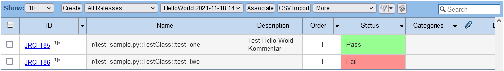

# Pytest Rmsis Plugin

This plugin synchronize test reports to Jira RMsis. Following test attributes are synchronized:

* Run result: passed, failed, skipped
* Description of testcase 
* Jira requirement

Free software: MIT license

## Installation

```
pip install pytest-rmsis
```

## Konfiguration

In order to synchronize test result with RMsis, you have to specify a few parameters:

* RMsis User Name
* RMsis Password
* RMsis URL
* RMsis Project Name (for example: DLE_RMsis_CI_integration)
* RMsis Release Name (for example: helbling-test-framework)
* Optional RMsis Testrun Name (otherwise the Testrun is named: Pytest)

These parameters can directly be set in the shell:

```bash
pytest --rmsis \
       --rmsis-user <USERNAME> \
       --rmsis-password <PASSWORD> \
       --rmsis-url https://jira.example.de:3601 \
       --rmsis-project "My Project" \
       --rmsis-release "My Release" \
       --rmsis-testrun "My Testrun"
```

or in the `pytest.ini`:

```
[pytest]
addopts = --rmsis 
          --rmsis-user <USERNAME> 
          --rmsis-password <PASSWORD> 
          --rmsis-url https://jira.example.de:3601 
          --rmsis-project "My Project" 
          --rmsis-release "My Release" 
          --rmsis-testrun "My Release"
```
The flag --rmsis is the On/Off flag for the synchronisation. So if you don't want to synchronize with RMsis, remove it from the parameter list.

All parameters can also be configured by environment variables: `RMSIS_USR`, `RMSIS_PSW`, `RMSIS_URL`, `RMSIS_PROJECT`, `RMSIS_RELEASE` and `RMSIS_TESTRUN`.


## Synchronisation

Each test in pytest has an unique identification based on the file path of the test and the class name and the test name:  `r/test_sample.py::TestClass::test_one`. This unique identifier is used as the name of a testcase. This allows to have a mapping of testcases in RMsis to testcases in pytest.



### Description 

The doc-string of a test is synchronized as description by each pytest execution. The description in Rmsis will be overwritten.

```python
def test_me():
       """Description which is synchronized"""
       assert True
```

### Planned Requirements

If a test is marked with `@pytest.mark.rmsis_requirement("KEY")`, the test case is linked to the planned requirement with the key.

```python
@pytest.mark.rmsis_requirement("JRCI-R1")
def test_me():
       assert True
```

If the key changes in the python test, the old linking will not be deleted in RMsis. It has to be deleted manually.

### Temporary Disable Synchronization

The synchronization can be disabled on function-scope:
```python
@pytest.mark.skip_rmsis
def test_me():
       assert True
```

## FAQ

1. Does pytest delete testcases in RMsis? - No testcases are deleted
2. What happens if a testcase is renamed in pytest? - Pytest will create a new testcase in RMsis. You have to manually delete the old testcase in RMsis.
3. What will happen if a testcase in RMsis is deleted? - Pytest will create a new testcase in RMsis
4. Are steps synchronized to RMsis? - No, native pytest does not support the concept of steps. `pytest-steps` is not supported.
5. Can attachements be uploaded to RMsis as result of a testrun? - No, the RMsis API does not support the upload of attachements.

# Roadmap

1. Synchronization of Categories:  `@pytest.mark.rmsis_cateogry("category")`
2. Overwrite test case name:  `@pytest.mark.rmsis_testcase("Name of testcase")`
3. Porting to Rmsis on Jira Cloud